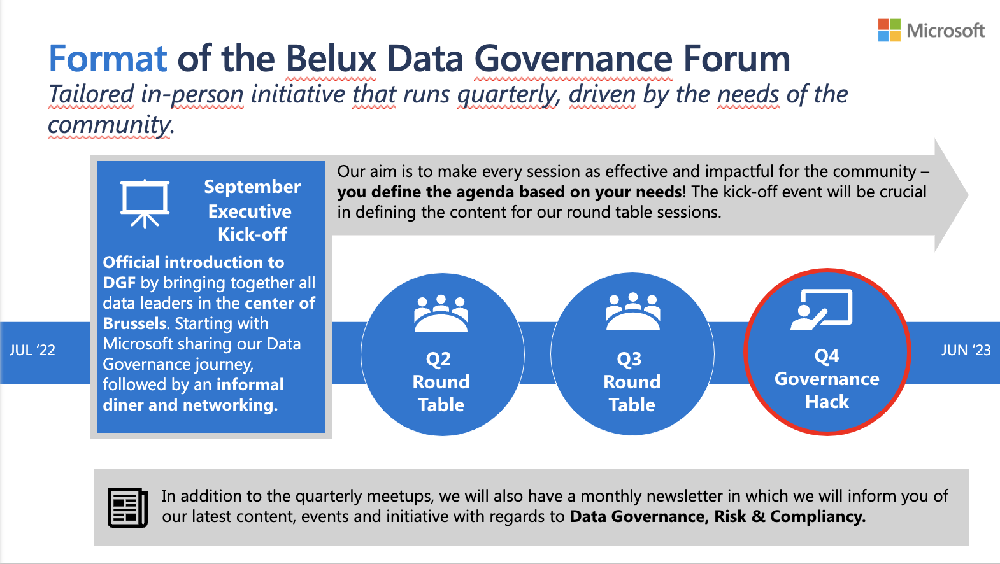

# Microsoft Purview In A Day

Microsoft Purview In A Day is a single day event which is all about Data Governance. During the day you'll participate in different presentations, inspiration sessions and hands-on challenges. It provides a good balance between state-of-the-art theory and hands-on experience.

The Purview In A Day is all about 2 challenges in which you'll be enabled with relevant concepts, and go deep in a hands-on exercises.

### Challenge 1

[Liam, Wesley] To be completed with a concrete explanation.

### Challenge 2

[Cedric] To be completed with a concrete explanation.

## What is Microsoft Purview?

Microsoft Purview is a unified data governance service that helps you manage and govern your on-premises, multi-cloud and software-as-a-service (SaaS) data. Easily create a holistic, up-to-date map of your data landscape with automated data discovery, sensitive data classification and end-to-end data lineage. Empower data consumers to find valuable, trustworthy data.

## :books: Preface

- [Preface: Introduction to Data Governance and Purview](./modules/preface.md)

## :thinking: Prerequisites

To complete this workshow you'll need to have access to an Azure subscription, and be able to install a custom template.

- An [Azure account](https://azure.microsoft.com/free/) with an active subscription. Note: If you don't have access to an Azure subscription, you may be able to start with a [free account](https://www.azure.com/free).
- You must have the necessary privileges within your Azure subscription to create resources, perform role assignments, register resource providers (if required), etc.

## :test_tube: Lab Environment Setup

Before getting started read below tutorial of how to setup to different services in your account.

- [Lab Environment](./modules/module00.md)

## :books: Challenge 1

0. [Create a Microsoft Purview Account](./modules/module01.md)
1. Register & Scan: [2A. Azure Data Lake Storage Gen2 (Managed Identity)](./modules/module02a.md) | [2B. Azure SQL Database (Azure Key Vault)](./modules/module02b.md)
2. Collection Hierarchy
3. Data catalog
4. [Lineage](./modules/module06.md)

## :books: Challenge 2

0. If not already done, [create a Microsoft Purview Account](./modules/module01.md)
1. [Glossary](./modules/module04.md)
2. [Insights](./modules/module07.md)
3. [Data Sharing](./modules/module16.md)
4. [Metamodel](./modules/module17.md)

<a href="#microsoft-purview-workshop">↥ back to top</a>

## All Modules

1. [Create a Microsoft Purview Account](./modules/module01.md)
2. Register & Scan: [2A. Azure Data Lake Storage Gen2 (Managed Identity)](./modules/module02a.md) | [2B. Azure SQL Database (Azure Key Vault)](./modules/module02b.md)
3. [Search & Browse](./modules/module03.md)
4. [Glossary](./modules/module04.md)
5. [Classifications](./modules/module05.md)
6. [Lineage](./modules/module06.md)
7. [Insights](./modules/module07.md)
8. [Monitor](./modules/module08.md)
9. [Integrate with Azure Synapse Analytics](./modules/module09.md)
10. [REST API](./modules/module10.md)
11. [Securely scan sources using Self-Hosted Integration Runtimes](./modules/module11.md)
12. [Managed private endpoints](./modules/module12.md)
13. [Process events using Atlas Kafka topics via Event Hubs and NodeJS](./modules/module13.md)
14. [Data owner policies (Azure Storage)](./modules/module14.md)
15. [Azure SQL Database Lineage Extraction](./modules/module15.md)
16. [Data Sharing](./modules/module16.md)
17. [Metamodel](./modules/module17.md)
